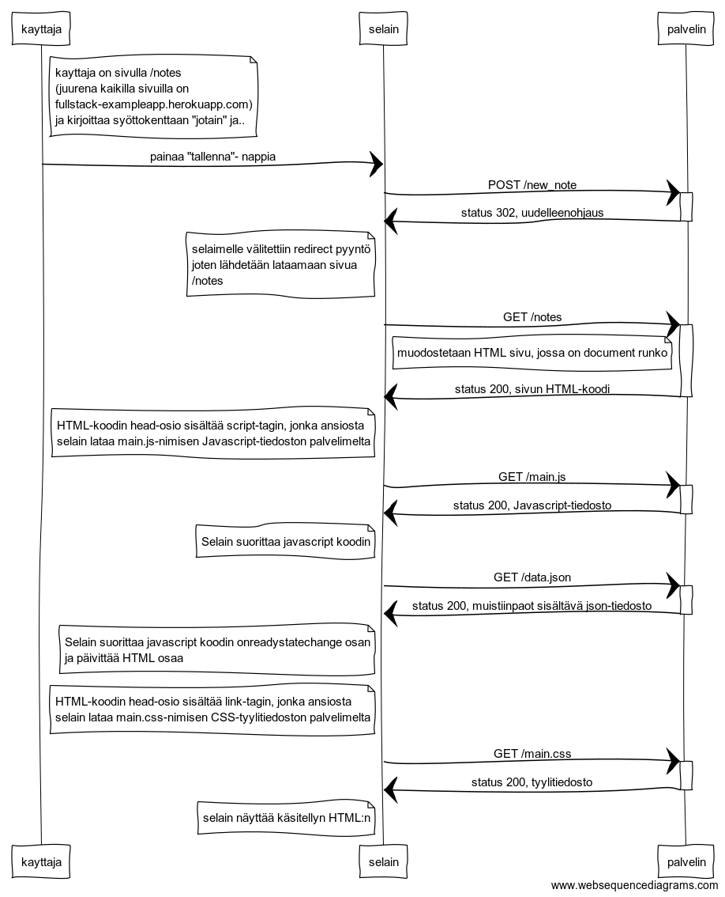

# 0.4 Uusi muistiinpano
Tee kaavio tilanteesta, missä käyttäjä luo uuden muistiinpanon ollessaan sivulla [https://fullstack-exampleapp.herokuapp.com/notes](https://fullstack-exampleapp.herokuapp.com/notes), eli kirjoittaa tekstikenttään jotain ja painaa nappia tallenna.

- Alkutilanne
- POST lähetys
	- uudelleenohjaus
- Sivun uudellen lataus
	- 4 GET pyyntöä

## Sekvenssikaavio

## "koodi" [https://www.websequencediagrams.com/](https://www.websequencediagrams.com/) sivulle

note right of kayttaja
	kayttaja on sivulla /notes
	(juurena kaikilla sivuilla on
	fullstack-exampleapp.herokuapp.com)
	ja kirjoittaa syöttokenttaan "jotain" ja.. 
end note
kayttaja->selain: painaa "tallenna"- nappia

selain->+palvelin: POST /new_note
palvelin->-selain: status 302, uudelleenohjaus
note left of selain
	selaimelle välitettiin redirect pyyntö
	joten lähdetään lataamaan sivua
	/notes
end note

selain->+palvelin: GET /notes
note left of palvelin
	muodostetaan HTML sivu, jossa on document runko
end note
palvelin->-selain: status 200, sivun HTML-koodi
note left of selain
	HTML-koodin head-osio sisältää script-tagin, jonka ansiosta 
	selain lataa main.js-nimisen Javascript-tiedoston palvelimelta
end note

selain->+palvelin: GET /main.js
palvelin->-selain: status 200, Javascript-tiedosto
note left of selain
	Selain suorittaa javascript koodin
end note

selain->+palvelin: GET /data.json
palvelin->-selain: status 200, muistiinpaot sisältävä json-tiedosto
note left of selain
	Selain suorittaa javascript koodin onreadystatechange osan 
	ja päivittää HTML osaa
end note

note left of selain
	HTML-koodin head-osio sisältää link-tagin, jonka ansiosta 
	selain lataa main.css-nimisen CSS-tyylitiedoston palvelimelta
end note
selain->+palvelin: GET /main.css
palvelin->-selain: status 200, tyylitiedosto

note left of selain
	selain näyttää käsitellyn HTML:n
end note

