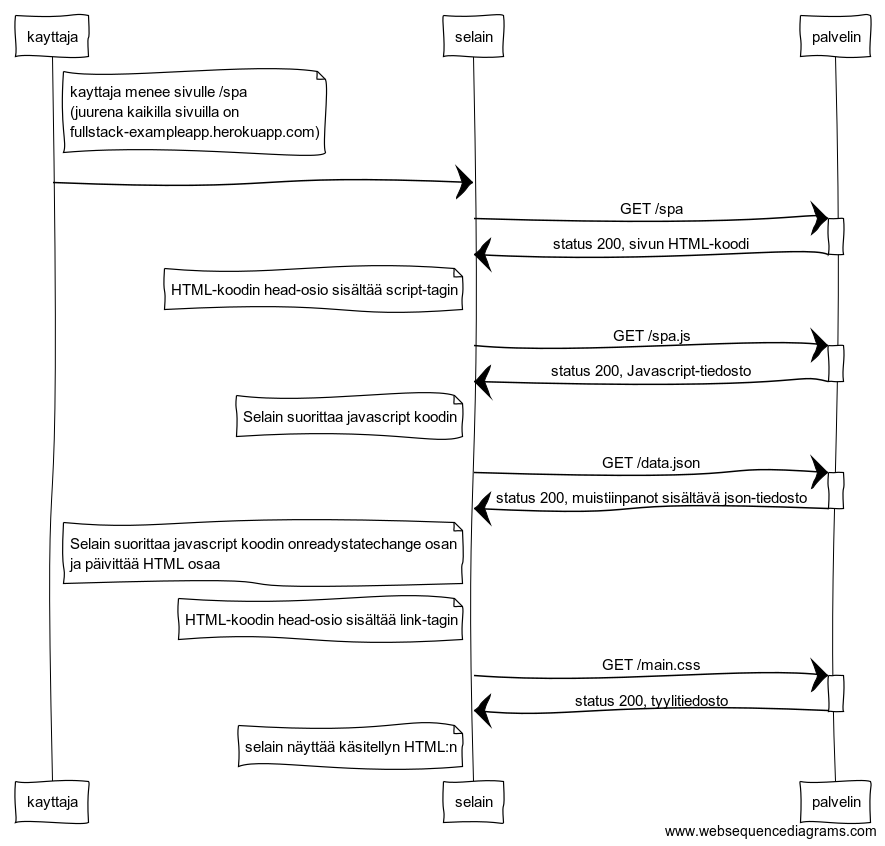

# 0.5 Single page app

Tee kaavio tilanteesta, missä käyttäjä menee selaimella osoitteeseen [https://fullstack-exampleapp.herokuapp.com/spa](https://fullstack-exampleapp.herokuapp.com/spa) eli muistiinpanojen single page app-versioon

## Sekvenssikaavio

## "koodi" [www.websequencediagrams.com](https://www.websequencediagrams.com/) sivulle

note right of kayttaja
	kayttaja menee sivulle /spa
	(juurena kaikilla sivuilla on
	fullstack-exampleapp.herokuapp.com)
end note
kayttaja->selain: 

selain->+palvelin: GET /spa
palvelin->-selain: status 200, sivun HTML-koodi
note left of selain
	HTML-koodin head-osio sisältää script-tagin
end note

selain->+palvelin: GET /spa.js
palvelin->-selain: status 200, Javascript-tiedosto
note left of selain
	Selain suorittaa javascript koodin
end note

selain->+palvelin: GET /data.json
palvelin->-selain: status 200, muistiinpanot sisältävä json-tiedosto
note left of selain
	Selain suorittaa javascript koodin onreadystatechange osan 
	ja päivittää HTML osaa
end note

note left of selain
	HTML-koodin head-osio sisältää link-tagin
end note
selain->+palvelin: GET /main.css
palvelin->-selain: status 200, tyylitiedosto

note left of selain
	selain näyttää käsitellyn HTML:n
end note
