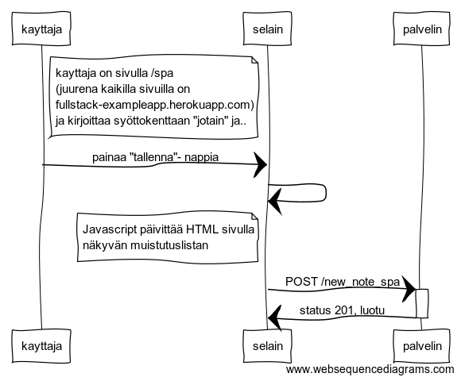

# 0.6 Uusi muistiinpano SPA:ssa

Tee kaavio tilanteesta, missä käyttäjä luo uuden muistiinpanon single page -versiossa.

## Sekvenssikaavio

## "koodi" [www.websequencediagrams.com](https://www.websequencediagrams.com/) sivulle

note right of kayttaja
	kayttaja on sivulla /spa
	(juurena kaikilla sivuilla on
	fullstack-exampleapp.herokuapp.com)
	ja kirjoittaa syöttokenttaan "jotain" ja.. 
end note
kayttaja->selain: painaa "tallenna"- nappia

selain->selain: 
note left of selain
    Javascript päivittää HTML sivulla 
    näkyvän muistutuslistan
end note

selain->+palvelin: POST /new_note_spa
palvelin->-selain: status 201, luotu

